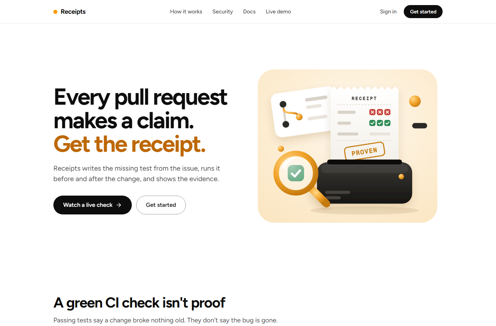
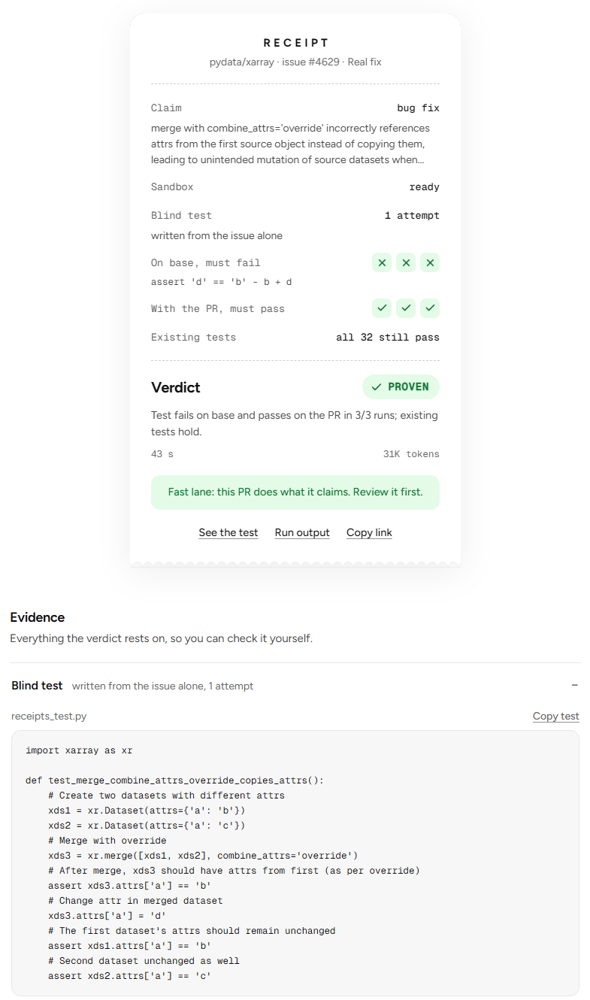

# Receipts UI

**Proof that a pull request does what it claims.** This is the web app for Receipts: the landing page, the
no-sign-in live demo, sign-in, your repositories and pull requests, and public receipt pages.

[](https://github.com/Bhuvansai-16/Receipts-frontend/actions/workflows/tests.yml)
[](LICENSE)
[](https://receipts-frontend-six.vercel.app/demo)

- **Live:** https://receipts-frontend-six.vercel.app (demo with no account at
  [/demo](https://receipts-frontend-six.vercel.app/demo))
- **The main README**, with how Receipts works and how it uses NVIDIA Nemotron on Nebius Token Factory, is in
  [Bhuvansai-16/Receipts-backend](https://github.com/Bhuvansai-16/Receipts-backend).





It talks only to the Receipts API, which handles sign-in through Neon Auth and stores runs in Neon Postgres.

## Develop

Needs Node 24 (npm 11 wrote `package-lock.json`; npm 10, which ships with Node 22, can't install it).

```bash
npm install
cp .env.example .env    # VITE_API_URL: where the API runs (default http://localhost:8000)
npm run dev             # http://localhost:5173
npm test                # unit tests
```

Run the API next to it (`python -m receipts serve` in `receipts-backend`). The API's `FRONTEND_URL` must be
this app's origin (`http://localhost:5173` by default), or the browser blocks its responses.

## Structure

- `src/site/`: public pages in one layout with the navbar and footer: Home, Live demo (`/demo`), How it works,
  Security, Docs, and public receipts (`/runs/:id`). Illustrations are inline SVG (`illustrations.tsx`).
- `src/pages/`: sign-in and sign-up, the live demo, the public receipt page.
- `src/app/`: the signed-in app at `/app`: Overview (setup checklist), Repositories, Pull requests
  (`/app/repos/:owner/:repo`), Receipts, Try a demo, Account.
- `src/components/`: the receipt card, evidence, verdict chips, issue picker.
- `src/api.ts`: typed client for the API; `src/config.ts`: where the API and live events live;
  `src/session.tsx`: the signed-in user; `src/auth.ts`: Neon's auth client, pointed at the API's `/api/auth`
  proxy and loaded after first paint.

## Deploy on Vercel

The backend runs on Render at `https://receipts-backend-wnjy.onrender.com` (see `receipts-backend`'s
README). Vercel serves this app and forwards `/api/*` to the backend (`vercel.json`), so the browser talks to
one origin and the session cookie stays first-party, even on the free `*.vercel.app` and `*.onrender.com`
hostnames. Live events stream straight from the backend (`VITE_EVENTS_URL`), because Vercel ends proxied
requests after 120 seconds; that stream is public and needs no cookie.

1. `vercel.json` forwards `/api/*` to the backend; change its host there if the backend moves.
2. Vercel > Add New > Project > import this repository. Vite is detected: build `npm run build`, output
   `dist`.
3. Environment variable `VITE_EVENTS_URL` = `https://receipts-backend-wnjy.onrender.com` (Production and
   Preview). Leave `VITE_API_URL` unset: production builds then call `/api` on their own origin.
4. Deploy, then set the backend's `FRONTEND_URL` to this app's URL (CORS for the event stream, redirects after
   sign-in).

Without Vercel, `npm run build` writes a static site to `dist/` for any static host with every path falling
back to `index.html` (`public/_redirects` does this on Netlify and Cloudflare Pages); set `VITE_API_URL` to
the API at build time and serve both from one parent domain so the session cookie is sent.

## License

Apache-2.0. See [LICENSE](LICENSE).
